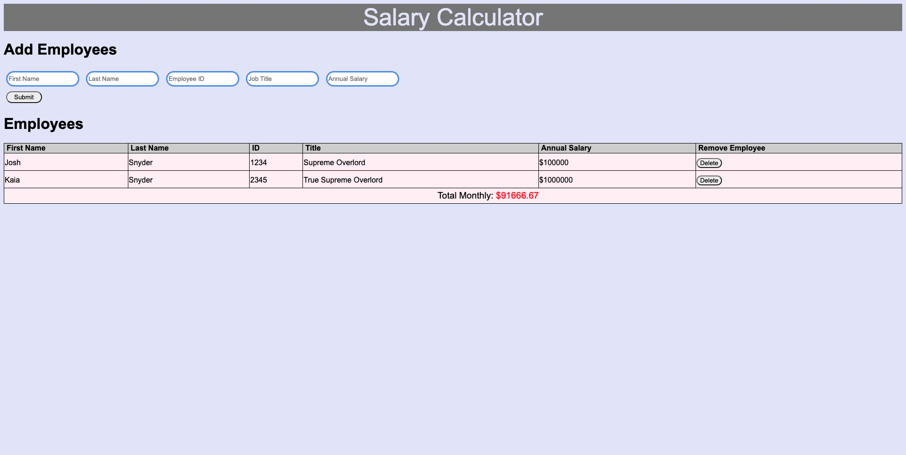

# Project Name
Salary Calculator

## Description

Duration: 3 days

Directly above this is how long it took you to develop the project. Your project description goes here. What problem did you solve? How did you solve it?

Client was looking for a calculator that could intake employee information for the purpose of calculating the business' monthly payroll cost. Client requested fields for employee first name, last name, ID, job title, and annual salary. 

Solving the client request included providing input fields for the desired employee information that would populate in a table just below to show record of the information being compiled.  With each row that is added, there is a removal option in case there is an issue with the entry.
All of the annual salary information that is compiled in the table is then added together to get the total sum of all salaries.  The sum is then divided by 12 to calculate the monthly  total. The monthly cost total is listed at the bottom of the table.  There is also a feature that highlights the total in red if the cost exceeds $20,000. The total is rounded to two decimals.

To see the fully functional site, please visit: #Website coming soon!!#

Screen Shot

Prerequisites
Link to software that is required to install the app (e.g. node).

Internet browser

Installation
To run this program, you will need to:

Open the index.html file in your browser.

That's it for now!! Pretty simple, huh?

<!-- Create a database named your database name,
The queries in the tables.sql file are set up to create all the necessary tables and populate the needed data to allow the application to run correctly. The project is built on Postgres, so you will need to make sure to have that installed. We recommend using Postico to run those queries as that was used to create the queries,
Open up your editor of choice and run an npm install
Run npm run server in your terminal
Run npm run client in your terminal
The npm run client command will open up a new browser tab for you!
Usage -->
How does someone use this application? 
To use this application, you will first type or paste the necessary information into the input fields. After all desired information is in the fields and correct, click the submit button.  From there, the application automatically compiles all of the salaries to a sum total and then divides that total by 12 to calculate the total monthly payroll cost.  If there is an error with an entry, there is a delete button to remove the row and it's information (currently only removes the displayed information; does not remove amount from total monthly cost.)

xxx
xxx
xxx
xxx
xxx
xxx
Built With

HTML
javascript
jQuery
CSS

License
None

Acknowledgement
Thanks to Prime Digital Academy who equipped and helped me to make this application a reality. Thanks to my cohort mates who help me out when I'm stuck on something. Thanks to Dane for teaching me what I need to know.

Support
If you have suggestions or issues, please email me at joshua.t.snyder@gmail.com
